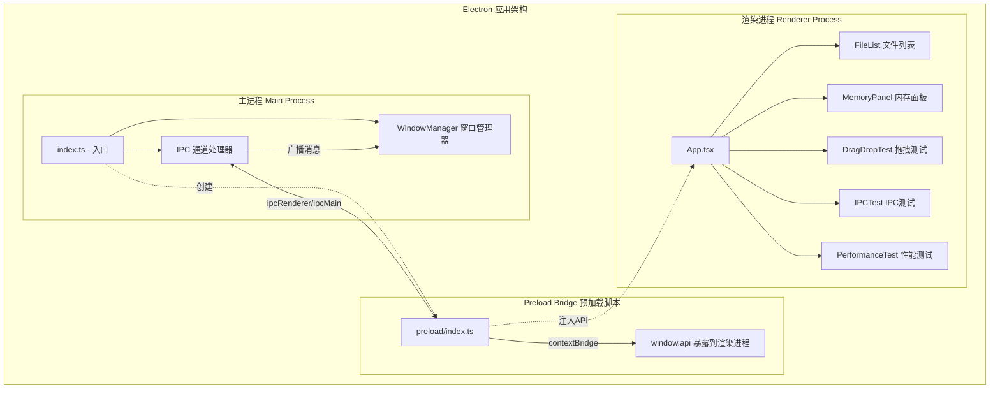
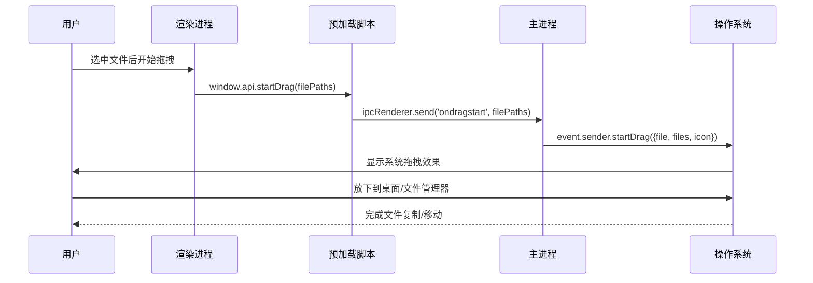
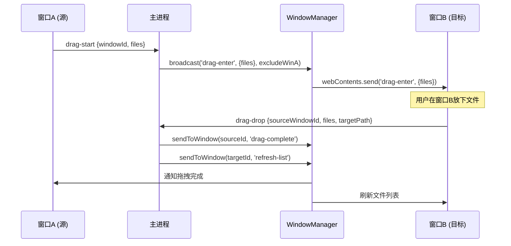
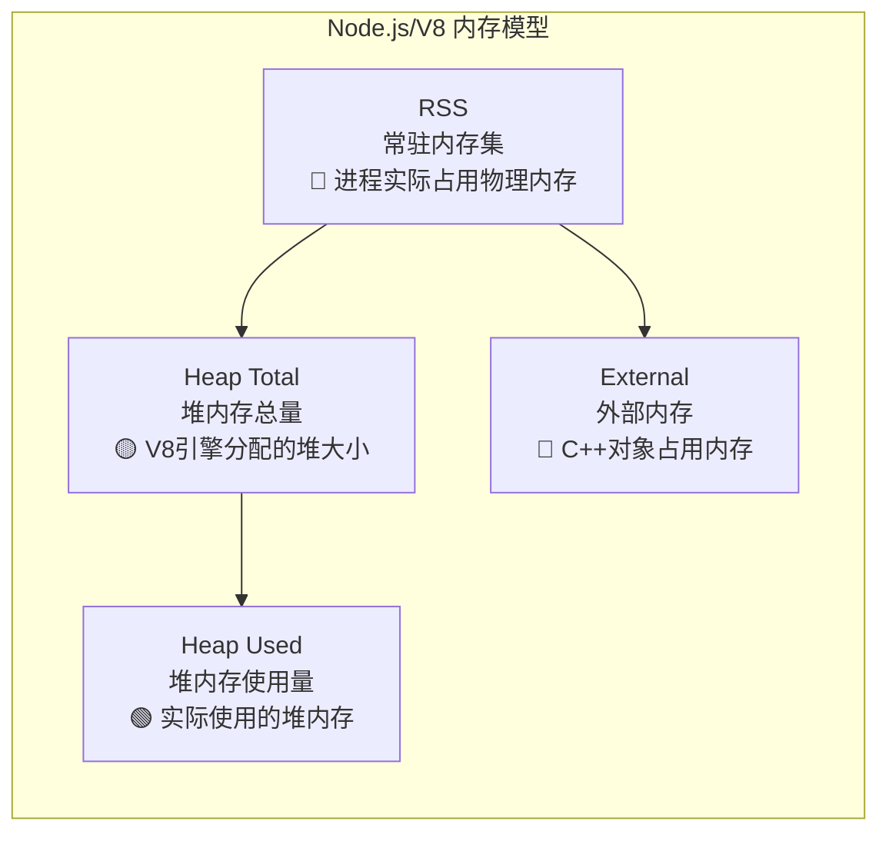
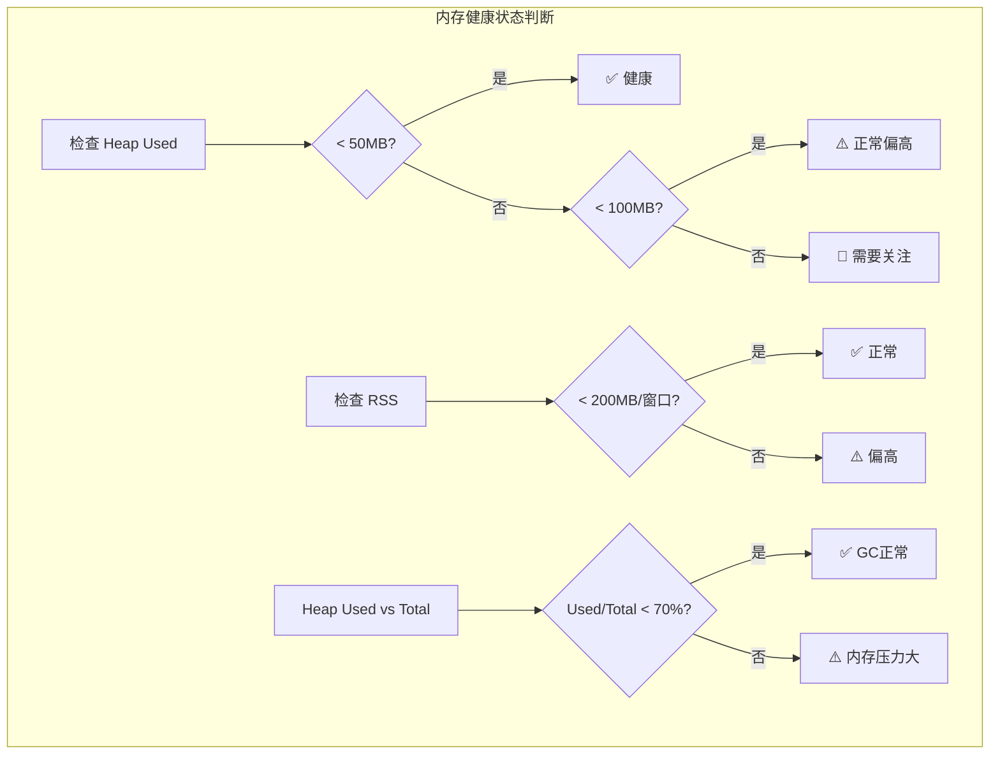
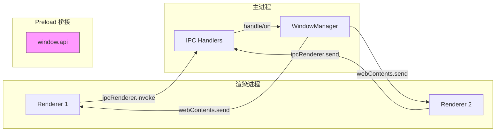

# Electron Drag Demo

An Electron application with React and TypeScript for demonstrating multi-window management, cross-window/cross-app drag-and-drop, and memory monitoring.

## 📖 项目核心逻辑解析

### 🏗️ 项目架构概览

这是一个基于 **Electron + React + TypeScript** 的多窗口文件管理器演示项目，核心功能包括：

1. **多窗口管理** - 创建和管理多个应用窗口
2. **跨窗口/跨应用拖拽** - 支持在窗口间拖拽文件
3. **内存监控** - 实时监控应用内存使用情况
4. **IPC 通信** - 主进程与渲染进程间的双向通信

---

### 🧩 整体架构图



---

### 🔄 拖拽逻辑详解

拖拽功能分为两种模式：

#### 1. 跨应用拖拽（拖到桌面/文件管理器）



**核心代码解读**：

```typescript
// 主进程 - 处理系统拖拽
ipcMain.on('ondragstart', (event, filePaths: string | string[]) => {
    const files = Array.isArray(filePaths) ? filePaths : [filePaths]
    event.sender.startDrag({
        file: files[0],    // 必需：主文件路径
        files: files,      // 多文件支持
        icon: iconPath     // 拖拽时显示的图标
    })
})
```

#### 2. 跨窗口拖拽（在应用多个窗口间拖拽）



---

### 📊 内存监控详解

#### 内存指标说明



#### 关键指标解读

| 指标 | 含义 | 关注点 |
|------|------|--------|
| **Heap Used** | 堆内存使用量 | 🟢 最重要！反映应用实际内存消耗 |
| **Heap Total** | V8分配的堆总量 | 🟡 如果远大于 Used，说明有未释放的内存 |
| **RSS** | 常驻内存集 | 🔴 进程在物理内存中的总占用 |
| **External** | 外部 C++ 对象 | 🔵 Buffer 等非 V8 管理的内存 |

#### 代码实现

```typescript
// 主进程 - 获取内存信息
ipcMain.handle('get-memory-usage', () => {
    const memUsage = process.memoryUsage()
    return {
        heapUsed: Math.round(memUsage.heapUsed / 1024 / 1024),   // MB
        heapTotal: Math.round(memUsage.heapTotal / 1024 / 1024), // MB
        rss: Math.round(memUsage.rss / 1024 / 1024),             // MB
        external: Math.round(memUsage.external / 1024 / 1024),   // MB
        windowCount: windowManager.getCount()
    }
})

// 获取所有进程的详细信息（包括渲染进程）
ipcMain.handle('get-all-memory-info', async () => {
    const processMetrics = app.getAppMetrics()  // Electron API
    return processMetrics.map((metric) => ({
        pid: metric.pid,       // 进程ID
        type: metric.type,     // 'Browser'主进程 / 'Tab'渲染进程
        memory: metric.memory.workingSetSize,  // KB
        cpu: metric.cpu.percentCPUUsage        // CPU百分比
    }))
})
```

#### 监控指标的健康标准



---

### 🔌 IPC 通信架构



#### 通信方式对比

| 方法 | 类型 | 用途 |
|------|------|------|
| `ipcRenderer.invoke` | 双向，有返回值 | 请求数据，如获取内存信息 |
| `ipcRenderer.send` | 单向 | 通知事件，如拖拽开始 |
| `webContents.send` | 主→渲染 | 推送通知，如广播消息 |

---

### 📁 项目文件结构

```
src/
├── main/                    # 主进程
│   ├── index.ts            # 入口：窗口创建、IPC设置、内存监控
│   └── windowManager.ts    # 窗口管理器：注册/广播/点对点通信
│
├── preload/                 # 预加载脚本
│   └── index.ts            # 桥接 API：暴露 window.api 到渲染进程
│
└── renderer/               # 渲染进程 (React)
    └── src/
        ├── App.tsx              # 主应用组件
        └── components/
            ├── DragDropTest.tsx   # 拖拽测试组件
            ├── MemoryPanel.tsx    # 内存监控面板
            ├── FileList.tsx       # 文件列表
            ├── IPCTest.tsx        # IPC 通信测试
            └── PerformanceTest.tsx # 性能测试
```

---

### 📌 功能模块总结

| 功能模块 | 核心实现 | 关键 API |
|----------|----------|----------|
| **多窗口** | `WindowManager` 类管理窗口生命周期 | `BrowserWindow`, `Map` |
| **拖拽** | 系统拖拽 + IPC广播通知 | `event.sender.startDrag()` |
| **内存监控** | 定时获取 + 面板展示 | `process.memoryUsage()`, `app.getAppMetrics()` |
| **IPC通信** | invoke/send + contextBridge | `ipcMain`, `ipcRenderer` |

---

## 🚀 Recommended IDE Setup

- [VSCode](https://code.visualstudio.com/) + [ESLint](https://marketplace.visualstudio.com/items?itemName=dbaeumer.vscode-eslint) + [Prettier](https://marketplace.visualstudio.com/items?itemName=esbenp.prettier-vscode)

## 📦 Project Setup

### Install

```bash
$ npm install
```

### Development

```bash
$ npm run dev
```

### Build

```bash
# For windows
$ npm run build:win

# For macOS
$ npm run build:mac

# For Linux
$ npm run build:linux
```
